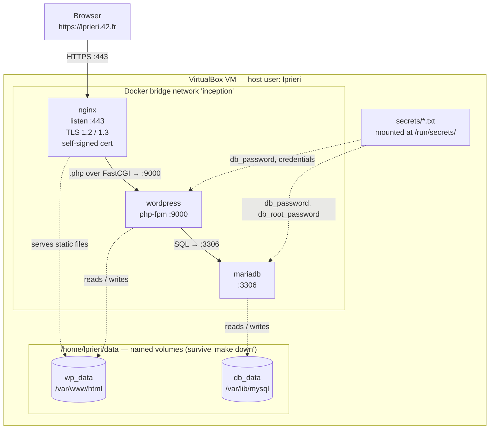

# Learner notes

Personal notes on the concepts behind this project — the "why it works this way," written to be understood and defended, not to satisfy the subject. Grows as the project does.

---

## How a `docker-compose.yml` actually works

Compose is **declarative**: you describe the desired end state, Compose reads the whole file, builds a model of what you declared, and reconciles reality to match. This is the opposite of a Makefile, which is **imperative** — a list of rules ("to build X, run these commands"). In compose you don't write actions; you write the picture of what should exist.

The key to reading the file is that there are **two kinds of names**, and telling them apart is the whole game.

### 1. Spec keywords — fixed vocabulary

These are defined by the Compose specification. You cannot rename them; Compose only recognizes this exact set. Typo one (`volumez:`) and Compose errors — proof it's a closed vocabulary, not free-form.

The four top-level keywords:

```
services:    # the containers
networks:    # the virtual switches they join
volumes:     # the persistent storage
secrets:     # files with sensitive content, mounted into containers
```

Inside a service, more keywords, each with a meaning and an expected value shape:

```
services:
  mariadb:         # <- NOT a keyword, my name (see below)
    build:         # keyword: path to a Dockerfile dir
    image:         # keyword: name to give the built image
    env_file:      # keyword: file of environment variables
    volumes:       # keyword: which volumes to mount, and where
    networks:      # keyword: which networks to join
    depends_on:    # keyword: start order
    restart:       # keyword: restart policy
```

### 2. My identifiers — names I coin, then reference by matching

`mariadb`, `inception`, `db_data`, `wp_data` are labels **I** chose. What makes them work is **name-matching across the file**: coin a name in one place (the *declaration*), refer to it by identical spelling elsewhere (the *reference*). Compose links them by matching the strings.

```
services:
  wordpress:
    volumes:
      - wp_data:/var/www/html   # reference: "use the volume called wp_data"
                                #            mounted at /var/www/html
volumes:
  wp_data:                      # declaration: here is what wp_data is
    driver: local
```

Same pattern everywhere identifiers connect parts:
- a service's `networks:` list references a network declared under top-level `networks:`
- a service's `secrets:` list references a secret declared under top-level `secrets:`

It's exactly like declaring a variable once and using it in several places.

### The mental model

- **Keywords are the grammar** — fixed, come from the spec.
- **My identifiers are the nouns** — I invent them.
- **Matching identical names is how the parts connect** — declaration in one place, references elsewhere.

### The `<name>:<path>` shorthand in mounts

In `volumes:` and (later) `secrets:` lists, the entry is `identifier:location-inside-container`. `wp_data:/var/www/html` means "mount the volume I called `wp_data` at the path `/var/www/html` inside this container." Left of the colon is one of my identifiers; right of the colon is a path in the container's filesystem.

---

## Anatomy of an `apt-get` line in a Dockerfile

The install line in the WordPress Dockerfile:

```dockerfile
RUN apt-get update && apt-get install -y \
        php-fpm php-mysql php-curl php-gd php-mbstring php-xml php-zip \
        curl mariadb-client && \
    rm -rf /var/lib/apt/lists/*
```

Four separate things are happening here.

### Why `apt-get update` first

Debian base images ship with an **empty package index** — `/var/lib/apt/lists/` is deliberately wiped by the image builders to keep the image small.

`apt-get install` doesn't search the internet. It reads that local index to answer: does `php-fpm` exist, what version is current, which mirror URL do I fetch it from? With no index I get `Unable to locate package php-fpm` and the build dies. `apt-get update` downloads it.

### Why one `RUN` and not two

Each `RUN` is a **cached layer**. Split across two:

```dockerfile
RUN apt-get update          # layer A — cached forever
RUN apt-get install -y ...  # layer B — the one I keep editing
```

Months later I add a package. Docker reuses the cached layer A and re-runs B — so I'm installing against a **stale index**. Debian mirrors only keep the *current* version of each package; the version my old index points at has been deleted from the mirror, and I get a 404. Chaining with `&&` means editing the install line invalidates the update too.

Same reason `rm -rf /var/lib/apt/lists/*` is inside this `RUN` rather than its own: deleting files in a *later* layer doesn't shrink the image. The bytes still sit in the earlier layer, and every layer ships.

### The `-y` flag

Short for `--yes`. By default `apt-get install` stops and asks:

```
After this operation, 84.2 MB of additional disk space will be used.
Do you want to continue? [Y/n]
```

A Docker build has no interactive terminal to answer that, so it hangs or aborts. `-y` pre-answers yes.

### The `php-*` packages are extensions, NOT plugins

This distinction matters and is easy to get backwards.

- A **PHP extension** is a compiled C module loaded into the PHP interpreter itself. It adds functions to the *language*.
- A **WordPress plugin** is PHP source code installed through wp-admin.

Extensions are what PHP *can do*; plugins are what WordPress *does with it*. Completely different layers.

| Package | What it gives PHP | Why WordPress needs it |
|---|---|---|
| `php-fpm` | FastCGI Process Manager — the daemon that actually executes PHP | nginx **cannot run PHP**. It forwards `.php` requests over FastCGI to this on port 9000 (hence `EXPOSE 9000`) |
| `php-mysql` | `mysqli` / `pdo_mysql` drivers | WordPress stores *everything* in MariaDB — posts, users, settings. Without this the installer refuses to start |
| `php-curl` | HTTP client bound into PHP | Update checks, downloading plugins/themes, calling external APIs |
| `php-gd` | Image manipulation library | Generating thumbnails and resized copies on every media upload |
| `php-mbstring` | Multibyte-safe string functions | UTF-8. `strlen("é")` is wrong without it — breaks accents, emoji, non-Latin scripts |
| `php-xml` | XML parser | RSS feeds, oEmbed, the WXR import/export format |
| `php-zip` | Zip archive handling | Plugins and themes are distributed as `.zip` |

Strictly, WordPress boots with only `php-fpm` and `php-mysql`. The rest are the ones normal use hits immediately, so they go in up front instead of being debugged later.

On bookworm, `php-fpm` is a **metapackage** that resolves to `php8.2-fpm` (`apt-cache depends php-fpm` confirms it). Debian pins one PHP version per release, and that version leaks into paths — see the next section.

### `curl` and `mariadb-client`

Two separate packages — the whole thing is just a space-separated list.

**`curl`** is the command-line tool, used to download the WP-CLI phar. Not the same as `php-curl`: that's a library bound into the interpreter, this is a standalone binary callable from a shell script.

**`mariadb-client`** gives the `mariadb` CLI binary. Three things worth pulling apart in that phrase:

*CLI binary* — a compiled executable run by typing its name at a shell prompt. Contrast a *library* (code other programs call, like `php-curl`) and a *daemon* (sits in the background listening, like `php-fpm`).

*client vs. server* — MariaDB ships as two halves:

| | package | what it is |
|---|---|---|
| server | `mariadb-server` | the daemon `mariadbd`. Owns the data files, listens on 3306, executes queries. **Lives in the other container.** |
| client | `mariadb-client` | the program `mariadb`. Connects over the network to a server and sends it SQL. Stores no data at all. |

So this does **not** put a database in the WordPress container. It gives that container the ability to *talk to* the database container.

*mariadb vs. mysql* — verified in a throwaway container, they are the same program:

```
/usr/bin/mariadb           (5.2 MB executable)
/usr/bin/mysql -> mariadb  (symlink)
```

MariaDB is a fork of MySQL and kept the old names as aliases so existing scripts don't break.

Why WordPress needs a DB client at all: `depends_on:` only waits for the MariaDB container to **start**, not for the database inside to be **ready for connections**. There's a gap of several seconds. `init.sh` uses the client to poll across that gap before running `wp core install`.

---

## WP-CLI and the `.phar`

```dockerfile
RUN curl -sSL -o /usr/local/bin/wp \
        https://github.com/wp-cli/wp-cli/releases/download/v2.12.0/wp-cli-2.12.0.phar && \
    chmod +x /usr/local/bin/wp
```

A **`.phar`** (PHP Archive) is the PHP equivalent of a Java `.jar` or a Python zipapp: an entire application — hundreds of `.php` files plus dependencies — zipped into one file, with a stub at the front so PHP executes it directly instead of me unpacking it.

**WP-CLI** is the official command-line interface to WordPress, and it's what lets the container configure itself **non-interactively** at startup:

```bash
wp core install --url=... --title=... --admin_user=... --admin_password=...
wp user create ...
```

That's the whole point for Inception — nobody is there to click through WordPress's browser install wizard.

**Why a phar and not `apt-get install wp-cli`?** Debian doesn't package it; there's no `wp-cli` in bookworm's repos. Upstream ships a phar and that's the only option.

**Why `chmod +x` makes `wp` work like a normal command:** the phar's first line is a shebang (`#!/usr/bin/env php`). The kernel reads it, starts the PHP interpreter, and hands it the rest of the file. `/usr/local/bin` is already on `PATH`.

**A dependency worth knowing about:** running `wp` needs a `php` **CLI** binary, but `php-fpm` is a daemon, not a shell command. See the next section — this is why `php-cli` is now named explicitly.

---

## Two habits: name your version once, name your dependencies

Both of these came out of the same read-through of the WordPress Dockerfile, and both are about **making implicit things explicit**.

### 1. Debian's PHP version leaks into paths

Debian pins exactly one PHP version per release (bookworm → 8.2) and stamps that version into two places. Verified in a throwaway container:

```
/usr/sbin/php-fpm8.2                      <- no unversioned symlink exists
include=/etc/php/8.2/fpm/pool.d/*.conf    <- inside php-fpm.conf
```

So the version appears in the **config path** *and* in the **binary name** I have to launch from `init.sh`.

The original Dockerfile hardcoded `8.2` in the `COPY` destination while installing the *metapackage* `php-fpm`. Those two can drift silently: if the base image ever moved to PHP 8.3, apt would happily install 8.3, my `COPY` would create a dead `/etc/php/8.2/` directory that php-fpm never reads, and I'd get a **running container with the wrong config and no error anywhere**.

Fix — declare the version once with `ARG`, and pin the packages to match:

```dockerfile
ARG PHP_VERSION=8.2
ENV PHP_VERSION=${PHP_VERSION}

RUN apt-get update && apt-get install -y \
        php${PHP_VERSION}-fpm php${PHP_VERSION}-cli ... && \
    rm -rf /var/lib/apt/lists/*

COPY conf/www.conf /etc/php/${PHP_VERSION}/fpm/pool.d/www.conf
```

Three things this buys:

- The version lives in **one place**, and is overridable: `docker build --build-arg PHP_VERSION=8.3`
- `ENV` promotes it into the *running* container, so `init.sh` can `exec php-fpm${PHP_VERSION} -F` instead of hardcoding the binary name a second time
- Pinning `php8.2-fpm` instead of the metapackage turns that silent-drift scenario into a **loud build failure**: `E: Unable to locate package php8.3-fpm`. Failing loudly at build time beats failing subtly at runtime.

⚠️ `COPY` expands build variables in its destination, but does **not** glob-expand it. `COPY x /etc/php/*/fpm/...` silently creates a directory literally named `*`. Variables yes, wildcards no.

### 2. Direct vs. transitive dependencies

- **Direct** — a package I named myself in the `apt-get install` line.
- **Transitive** — a package apt installed *because something else needed it*, not because I asked.

I asked for `php-mysql`. That package declares "I need a PHP interpreter to plug into," apt resolves that requirement, and satisfies it with `php8.2-cli`. I never typed `php-cli` anywhere — it came along for the ride. That is the only reason `/usr/bin/php` exists, and therefore the only reason `wp` runs at all.

**Why that's fragile:** nothing in the Dockerfile records that I *need* the PHP CLI, yet WP-CLI cannot run a single command without it. Drop a package later, reorder the list, or let Debian reshuffle its dependency declarations in a future release, and `/usr/bin/php` can simply stop existing. `wp` dies with `php: not found` and nothing in the file hints at why.

**Fix:** name `php-cli` explicitly. The image doesn't grow by a single byte — apt sees it's already satisfied and does nothing. What changes is that the Dockerfile now *states* the dependency instead of inheriting it by luck.

The general habit: **depend on things explicitly; never rely on what happens to arrive as a side effect.**

---

## Who you are to MariaDB: host patterns and socket auth

This one cost me a debugging session, so it's worth writing down properly. It comes down to a single idea: MariaDB's notion of *identity* is richer than "a username and a password," and both halves of that surprised me.

### An account is a pair, not a name

`'wp_user'@'localhost'` and `'wp_user'@'%'` are **two different accounts**. Same username, separate passwords, separate privileges, and creating one tells you nothing about the other. The host half is a pattern describing *where the connection may come from*; `%` is the SQL wildcard for "anywhere."

That's why `init.sh` creates the WordPress user as `'${MYSQL_USER}'@'%'` — WordPress connects from a *different container*, so from MariaDB's point of view it arrives from a foreign IP on the bridge network, not from localhost. This is the account-level twin of the `bind-address` fix in `50-server.cnf`: one is the server refusing to **listen** beyond localhost, the other is an account refusing to be **used** from beyond it. Both have to be solved or WordPress can't connect.

### Matching is by specificity — and that's what bit me

When a login arrives, MariaDB does not scan for the first account that fits. It picks the **most specific host pattern** that matches, and then checks the password against *that* account only. A literal `localhost` is more specific than the wildcard `%`, so it wins.

The trap: `mysql_install_db` leaves behind two **anonymous accounts** — empty username, no password — at `''@'localhost'` and `''@'<container hostname>'`. So this happened:

```
$ docker exec mariadb mysql -u wp_user -p<correct password>
ERROR 1045 (28000): Access denied for user 'wp_user'@'localhost'
```

Correct password, account exists, and still denied. My connection came from inside the container, so it matched the anonymous `localhost` entry — which has *no* password — before it ever reached `'wp_user'@'%'`. Adding `-h 127.0.0.1` doesn't help: the client still reports the host as `localhost`.

What made this genuinely nasty is that **WordPress was never affected**. It connects from another container, whose IP matches `%` and not `localhost`, so the application worked perfectly while the documented manual test failed. A bug invisible in normal use and visible only when testing by hand is the kind that survives all the way to evaluation.

Fix, in the init SQL — the same thing `mysql_secure_installation` does, except that tool is interactive and can't run unattended:

```sql
DELETE FROM mysql.global_priv WHERE user='';
```

Bonus insight: this retroactively justifies `FLUSH PRIVILEGES`. `CREATE USER`, `GRANT` and `ALTER USER` all update the in-memory grant tables themselves, so the statement is usually ceremonial — but a direct `DELETE` on a grant table is exactly the case that *needs* an explicit reload.

### Socket auth: proving identity without a secret

The other half. There are two ways to reach the server:

| Transport | What the server sees |
|---|---|
| **TCP** (`host:3306`) | an IP address, nothing more — so it must demand a password |
| **Unix domain socket** (`/run/mysqld/mysqld.sock`) | a *file* on the local filesystem; only same-machine processes can open it |

The socket has a property TCP cannot have: both ends are processes on the **same kernel**, so the kernel already knows the client's OS user ID and will report it to the server on request. The client never transmits that ID and therefore cannot lie about it. There's no secret involved, so there's nothing to steal, forge, or replay.

The `unix_socket` plugin is just that: *ask the kernel which OS user is on the other end, and allow the login if that name matches the MariaDB username being requested.* OS `root` may log in as MariaDB `root`, no password.

A fresh install stores a **list of alternatives** for root, not a single method:

```
"auth_or": [ {}, { "plugin": "unix_socket" } ]
```

Verified in a throwaway container — three attempts, none of them supplying a password:

| Attempt | Result |
|---|---|
| `mysql -u root` as OS **root**, over the socket | `root@localhost` — in |
| `mysql -u root` as OS user **mysql**, over the socket | `ERROR 1698 Access denied` |
| `mysql -u root -h 127.0.0.1` as OS **root**, over TCP | `ERROR 1698 Access denied` |

Identical command every time. The only things that changed were *which OS user ran it* and *which transport it used* — which is precisely the point.

### Why `init.sh` leans on it, and where it stops

Both `mysqladmin ping --silent` and `mysql -u root <<-EOF` run as OS root inside the container over the socket, which is why neither needs credentials. That isn't laziness: it means **no password ever appears on a command line** during setup, where it would be visible to anything running `ps` inside the container.

Then the setup SQL ends this arrangement:

```sql
ALTER USER 'root'@'localhost' IDENTIFIED BY '${DB_ROOT_PASSWORD}';
```

and the alternatives collapse to one — the `unix_socket` entry is gone:

```
"auth_or": [ {} ]
```

Which is exactly why the *very next line* of the script suddenly needs `-p"${DB_ROOT_PASSWORD}"` to shut the server down. The authentication rules change halfway through the script, and that's the one detail I'd want to be able to explain on demand.

**The trade-off I'm accepting:** socket auth is arguably the *stronger* of the two here — nothing leaks into `docker inspect`, no hash to crack, and it cannot be used over the network at all. The subject wants a root password, so we set one, but the cost is that root becomes reachable by password alone and loses the socket route. MariaDB can keep both (`IDENTIFIED VIA unix_socket OR mysql_native_password USING PASSWORD(...)`), which is what production setups often do.

---

## Image names and tags: the `latest` that appears when you look away

A full image reference is `name:tag`. The tag is a human label for a version or variant — `debian:bookworm`, `node:20`. Docker attaches no meaning to the string itself.

The subject forbids the `latest` tag. I assumed that was about the base image, and `FROM debian:bookworm` handled it. It isn't only about that. A tag left off does **not** mean "no tag" — Docker silently fills in `:latest`:

```yaml
image: mariadb          # Docker reads this as mariadb:latest
```

So after `make`, `docker images` would show three images I built — `mariadb`, `wordpress`, `nginx` — all tagged `latest`, which is exactly what the rule prohibits. An evaluator runs `docker images`, sees `latest`, flags it. It's irrelevant that I built them locally rather than pulled them; the tag on disk is what's checked.

The rule therefore has **two** enforcement points, at opposite ends of the build:

| Where | Field | Fix |
|---|---|---|
| The image I build **from** | `FROM debian:bookworm` | pin the base tag ✓ |
| The image I build **into** | `image:` in compose | give it an explicit tag |

Fix — tag every built image explicitly:

```yaml
image: mariadb:inception
```

`inception` is arbitrary; any non-`latest` tag works. I use it because it's meaningful to a reader — it marks the image as *this project's* build, distinct from the official Docker Hub `mariadb` I'm forbidden to pull. The **name** (`mariadb`) is the constrained half: the subject requires it to match the service name.

The general habit, again: **make the implicit explicit.** A missing tag is a decision Docker makes for me, and it makes the one the subject bans.

---

## The whole chain: one request, end to end

Every arrow is a boundary I configured on purpose. Solid = a live network request; dotted = a filesystem mount.



Three things the picture makes obvious, and that I should be able to say out loud:

1. **One entrypoint.** Only nginx publishes a port (`443`). `wordpress:9000` and `mariadb:3306` are reachable *only* from inside the bridge network — no `ports:` entry, so neither the host nor the outside world can reach them.
2. **The shared volume is load-bearing.** `wp_data` is mounted by **both** nginx and wordpress at `/var/www/html`. nginx names a file (`SCRIPT_FILENAME`); php-fpm opens it. That only works because it's literally the same directory in both containers.
3. **Each cross-container hop repeats one lesson.** `fastcgi_pass wordpress:9000` and `--dbhost=mariadb` are the same move as MariaDB's `bind-address 0.0.0.0` and php-fpm's `listen 9000`: a container boundary turns "same machine" into "over the network," resolved by Docker's DNS on the service name.

---

## Commands for the evaluation

Grouped by what I need to *demonstrate*, not alphabetically. Each answers a question the evaluator actually asks.

### The stack is real and correct
```bash
docker ps                 # 3 containers Up; only nginx maps :443 to the host
docker images             # image names == service names; tags are :inception, never latest
docker network ls         # the inception bridge network exists
docker volume ls          # db_data and wp_data
```

### Prove the rules
```bash
# no password lives in an image's environment
docker inspect wordpress | grep -i -A3 '"Env"'

# two users, exactly one administrator; admin name has no "admin" substring
docker exec wordpress wp user list --fields=user_login,roles --allow-root

# the site works over TLS...
curl -k https://lprieri.42.fr

# ...but only TLS 1.2 / 1.3 — an older version is refused
curl -k --tls-max 1.1 https://lprieri.42.fr        # should fail

# the certificate is self-signed for the project domain
echo | openssl s_client -connect 127.0.0.1:443 -servername lprieri.42.fr 2>/dev/null \
    | openssl x509 -noout -subject -dates

# 443 is the only door — port 80 is closed
curl http://127.0.0.1:80/                          # should refuse
```

### Persistence and resilience (they will test these)
```bash
# a crashed container comes back on its own (restart: always)
docker kill nginx ; sleep 2 ; docker ps            # nginx is Up again

# data survives container destruction
make down && make up                               # site + users still there afterwards

# the hardest one: reboot the whole VM, then confirm the site is still up
# (containers restart automatically, volumes persist on disk)
```

### Look inside
```bash
docker exec -it mariadb mariadb -u wp_user -p wordpress   # into the database
docker logs nginx                                         # one service's logs
make logs                                                 # all three, live
```

### Prove no secret is in the git repo (the instant-fail check)
```bash
git ls-files | grep -E '\.env$|secrets/'    # must print nothing
git log --all -S 'my-password-value'        # must find no commit
```
